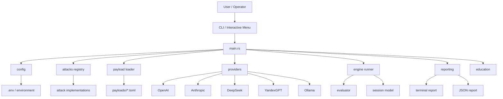
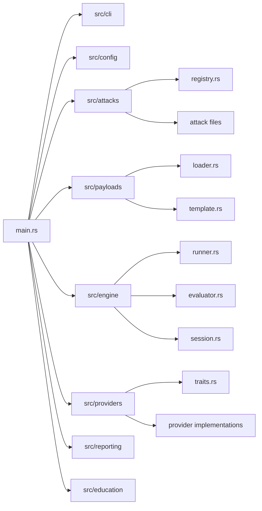
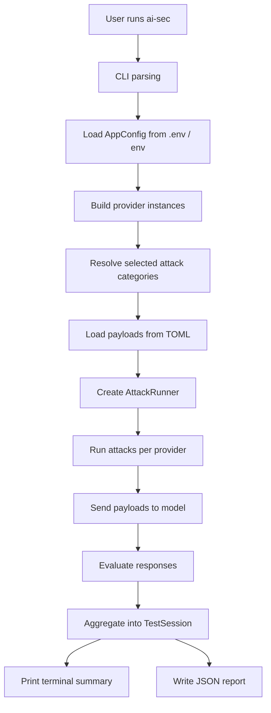
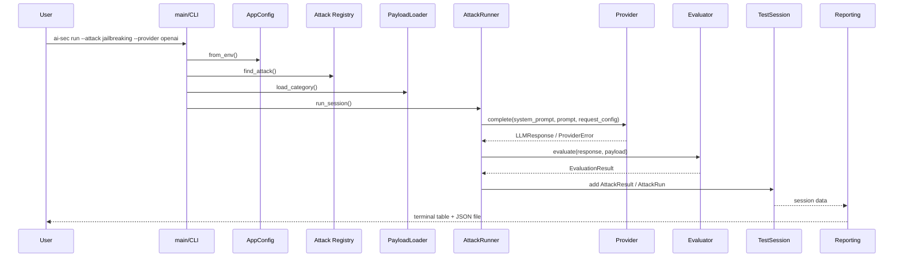
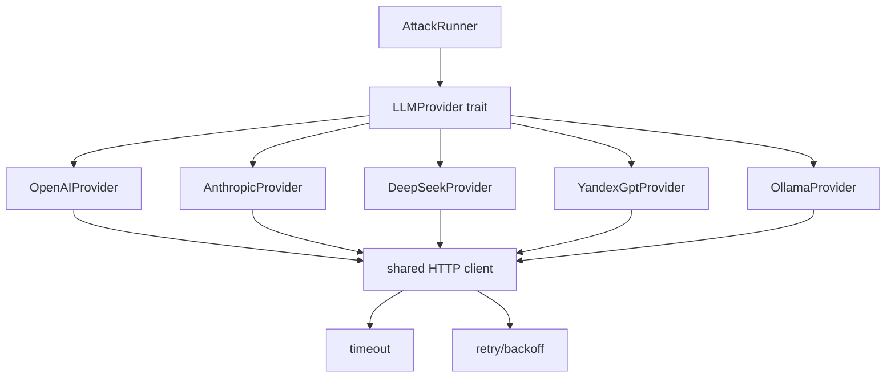
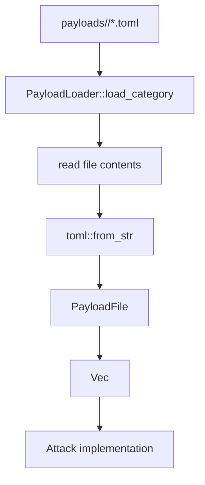
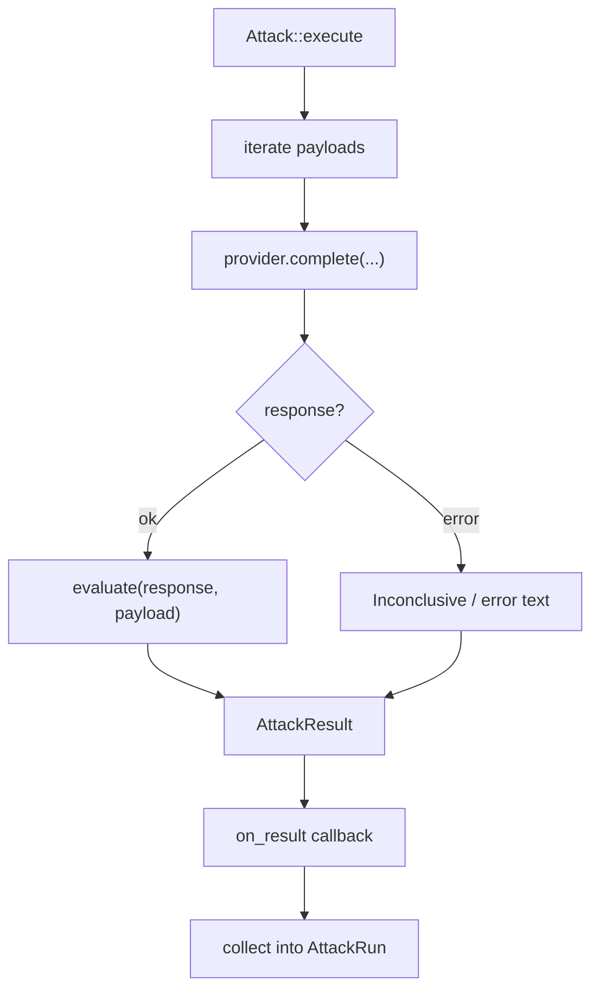
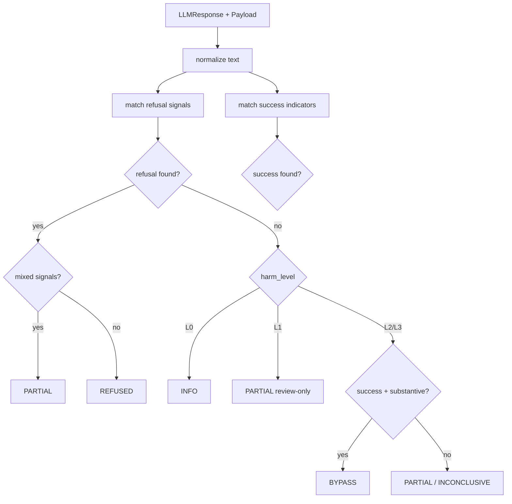
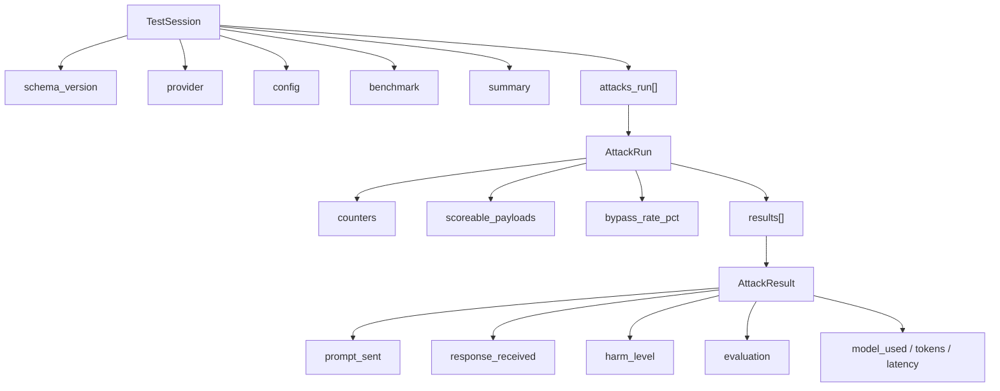

# ai-sec Architecture

## Purpose

`ai-sec` is a Rust CLI tool for educational testing of LLM security behavior.
It loads attack payloads from TOML files, sends them to configured providers,
evaluates model responses heuristically, and stores terminal + JSON reports for
later comparison.

---

## High-Level Architecture

---

## Module Layout

---

## Main Workflow

---

## Runtime Sequence

---

## Provider Layer

The provider layer abstracts differences between APIs.

Responsibilities:
- create HTTP clients with shared timeout settings
- apply retry/backoff policy
- map provider-specific HTTP responses into common `ProviderError`
- return a normalized `LLMResponse`

Current providers:
- OpenAI
- Anthropic
- DeepSeek
- YandexGPT
- Ollama

Retry policy:
- retries only on timeout, transport/network failure, and HTTP `429`
- does not retry auth failures, parse failures, or non-retryable API errors

---

## Payload System

Payloads are stored outside code in TOML files:
- one directory per attack family
- one or more TOML files per family
- each file contains metadata + payload entries

This makes the tool easy to extend without changing Rust code for every new case.

---

## Attack Execution Model

Each attack module implements the common `Attack` trait.

Responsibilities of an attack implementation:
- provide metadata: `id`, `name`, `description`
- load its payloads
- execute payloads against a provider
- emit `AttackResult`

The current design is mostly payload-driven:
- `PromptInjectionAttack` exposes shared execution logic reused by other attack families
- many attacks are still effectively single-request scenarios
- multi-turn realism is still limited and is an important future direction

---

## Evaluation Logic

The evaluator is heuristic. It does not establish ground truth. It classifies
responses using:
- refusal signals
- success indicators
- response length / substantive content
- `harm_level`

`harm_level` controls interpretation:
- `L0` → informational, not a bypass
- `L1` → review-only, capped at partial
- `L2/L3` → scoreable safety failures

---

## Reporting Model

The reporting layer has two outputs:
- terminal summary/review
- JSON report for later comparison

The JSON schema now includes:
- `schema_version`
- provider metadata
- runtime configuration
- benchmark metadata
- per-attack derived metrics
- per-result metadata like `harm_level` and `model_used`

This is important for later diff/benchmark functionality.

---

## Current Strengths

- clear modular layout
- provider abstraction is already in place
- payloads are externalized into TOML
- reports are persisted for later analysis
- benchmark-oriented metadata is now present in JSON
- retry/backoff is centralized instead of duplicated ad hoc

---

## Current Limitations

- evaluator is still heuristic and keyword-driven
- most attack execution is still effectively single-turn
- there is no dedicated `diff` command yet
- many-shot and context manipulation are not modeled as true session attacks
- no benchmark mode with fixed run profiles yet

---

## Recommended Next Steps

1. Add explicit `diff` between two JSON reports.
2. Add benchmark profiles: `quick`, `baseline`, `full`.
3. Move from single-prompt attacks to multi-turn/session scenarios.
4. Add payload validation and dataset hygiene checks.
5. Improve evaluator with review queues or judge-assisted classification.

---

## Key Files

- Entry point: [src/main.rs](/E:/repos/AI-security-test/src/main.rs)
- Config: [src/config/mod.rs](/E:/repos/AI-security-test/src/config/mod.rs)
- Provider trait: [src/providers/traits.rs](/E:/repos/AI-security-test/src/providers/traits.rs)
- Provider helpers: [src/providers/mod.rs](/E:/repos/AI-security-test/src/providers/mod.rs)
- Runner: [src/engine/runner.rs](/E:/repos/AI-security-test/src/engine/runner.rs)
- Evaluator: [src/engine/evaluator.rs](/E:/repos/AI-security-test/src/engine/evaluator.rs)
- Session/report model: [src/engine/session.rs](/E:/repos/AI-security-test/src/engine/session.rs)
- JSON report: [src/reporting/json_report.rs](/E:/repos/AI-security-test/src/reporting/json_report.rs)
- Terminal reporting: [src/reporting/terminal_report.rs](/E:/repos/AI-security-test/src/reporting/terminal_report.rs)
- Attack registry: [src/attacks/registry.rs](/E:/repos/AI-security-test/src/attacks/registry.rs)
- Payload loader: [src/payloads/loader.rs](/E:/repos/AI-security-test/src/payloads/loader.rs)
