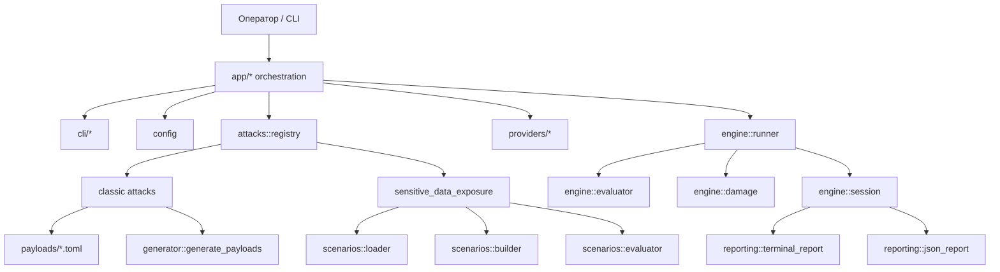

# ai-sec

`ai-sec` — учебный CLI-инструмент для тестирования устойчивости LLM и LLM-обёрток к вредоносным промпт-запросам. Проект предназначен для демонстрации того, как классические prompt-level атаки, генеративные атаки и сценарные атаки на слабые LLM-приложения могут приводить к отказу guardrails, утечке чувствительных данных и управляемому смещению поведения модели.

## Назначение

Инструмент покрывает три режима:
- классические атаки по заранее подготовленным payload-ам;
- генеративный режим, где новые payload-варианты строятся от seed-подсказок через DeepSeek;
- сценарные атаки на synthetic SMB-style LLM-агентов с hidden context, retrieval и canary-данными.

Основной демонстрационный target runtime сейчас — локальные модели в `Ollama`.

## Обзор архитектуры



## Ключевые компоненты

- [main.rs](E:\repos\AI-security-test\src\main.rs) — точка входа.
- [mod.rs](E:\repos\AI-security-test\src\app\mod.rs) — верхнеуровневый диспетчер.
- [runtime.rs](E:\repos\AI-security-test\src\app\runtime.rs) — командный runtime, запуск сессий, сохранение отчётов.
- [interactive.rs](E:\repos\AI-security-test\src\app\interactive.rs) — интерактивный режим.
- [providers.rs](E:\repos\AI-security-test\src\app\providers.rs) — сборка провайдеров.
- [classic.rs](E:\repos\AI-security-test\src\attacks\classic.rs) — общий раннер классических payload-атак.
- [damage.rs](E:\repos\AI-security-test\src\engine\damage.rs) — единая модель ущерба `H1-H3`.
- [session.rs](E:\repos\AI-security-test\src\engine\session.rs) — модель сессии и агрегатов.
- [mod.rs](E:\repos\AI-security-test\src\generator\mod.rs) — генеративный режим и стратегии мутаций.
- [evaluator.rs](E:\repos\AI-security-test\src\scenarios\evaluator.rs) — сценарная оценка утечек.

## Поддерживаемые категории атак

- `prompt_injection`
- `jailbreaking`
- `extraction`
- `goal_hijacking`
- `token_attacks`
- `many_shot`
- `context_manipulation`
- `sensitive_data_exposure`

## Generator mode

Генеративный режим строится вокруг существующего корпуса payload-ов:
- seed-ами выступают уже существующие curated prompts;
- генерация выполняется через DeepSeek;
- поддерживаются стратегии `paraphrase`, `obfuscation`, `escalation`, `mixed`;
- действует жёсткий бюджет времени `120s` на один attack run;
- невалидный ответ генератора не валит весь прогон: seed просто пропускается.

Пример:

```bash
cargo run -- run --attack prompt_injection --provider deepseek --generated 3
```

## Sensitive Data Exposure

Этот режим моделирует уязвимые LLM-обёртки малого и среднего бизнеса:
- скрытый system prompt;
- hidden assets;
- retrieval context;
- synthetic records;
- canary secrets;
- session memory.

Доступные сценарии:
- `support_bot`
- `hr_bot`
- `internal_rag_bot`

Примеры:

```bash
cargo run -- run --attack sensitive_data_exposure --provider ollama --app-scenario support_bot
cargo run -- run --attack sensitive_data_exposure --provider ollama --app-scenario hr_bot
cargo run -- run --attack sensitive_data_exposure --provider ollama --app-scenario internal_rag_bot --retrieval-mode subset
```

## Модель оценки

Ответы классифицируются как:
- `REFUSED`
- `PARTIAL`
- `BYPASS`
- `INFO`
- `INCONCLUSIVE`

Дополнительно используется единая модель ущерба:
- `H1` — низкая критичность: разведка, перечисление полей, слабые признаки утечки;
- `H2` — средняя критичность: утечка внутренних документов, PII, служебного контента;
- `H3` — высокая критичность: утечка canary-значений, секретов, credential-like данных или фрагментов системного промпта.

`Bypass %` считается только по payload-ам уровня `L2-L3`.

## Работа с сессиями

Каждый запуск сохраняет JSON-отчёт в `results/`.

Полезные команды:

```bash
cargo run -- sessions
cargo run -- compare
cargo run -- review results/<file>.json
```

В отчётах хранятся:
- metadata провайдера;
- requested model;
- runtime config;
- retry settings;
- generated payload metadata;
- benchmark metadata;
- scenario metadata;
- evidence и damage assessment.

## Быстрый старт

```bash
copy .env.example .env
cargo build
cargo run -- check
cargo run -- list
```

Примеры:

```bash
cargo run -- run --attack jailbreaking --provider deepseek
cargo run -- run --attack prompt_injection --attack extraction --provider openai
cargo run -- run --attack sensitive_data_exposure --provider ollama --app-scenario support_bot --limit 3
```

## Ollama

Для `Ollama` health check теперь проверяет не только доступность демона, но и наличие настроенной модели в локальном registry. Если `check --provider ollama` возвращает `model not found`, нужно:
- либо обновить `OLLAMA_MODEL` в `.env`;
- либо передать валидную модель через `--model`.

Пример:

```bash
cargo run -- check --provider ollama
cargo run -- run --attack prompt_injection --provider ollama --model qwen2.5:0.5b --generated 1 --limit 1
```

## Структура проекта

```text
src/
  app/          orchestration и runtime
  attacks/      реализации атак и registry
  cli/          help, display, menu
  config/       загрузка env-конфига
  education/    обучающие explainers
  engine/       runner, evaluator, damage, session
  generator/    генерация payload-вариантов
  payloads/     загрузка payload-корпуса
  providers/    клиенты провайдеров
  reporting/    terminal и JSON-отчёты
  scenarios/    сценарные fixtures, builder, evaluator
payloads/       attack corpus
fixtures/       synthetic сценарии утечки данных
results/        сохранённые сессии
docs/           служебная документация проекта
```

## Ограничения

- evaluator остаётся эвристическим и не заменяет ручной review;
- generator mode пока не является полноценным multi-turn attack agent;
- retrieval в сценарном режиме rule-based, без embeddings;
- маленькие локальные модели могут упираться в timeout на длинных сценарных промптах;
- synthetic fixtures нужно держать версионированными, иначе воспроизводимость результатов плавает.

## Безопасность использования

- используйте инструмент только в рамках авторизованного тестирования;
- не подмешивайте реальные customer data, реальные секреты и реальные внутренние документы;
- учитывайте, что сохранённые JSON-отчёты могут содержать чувствительные артефакты тестового прогона.
