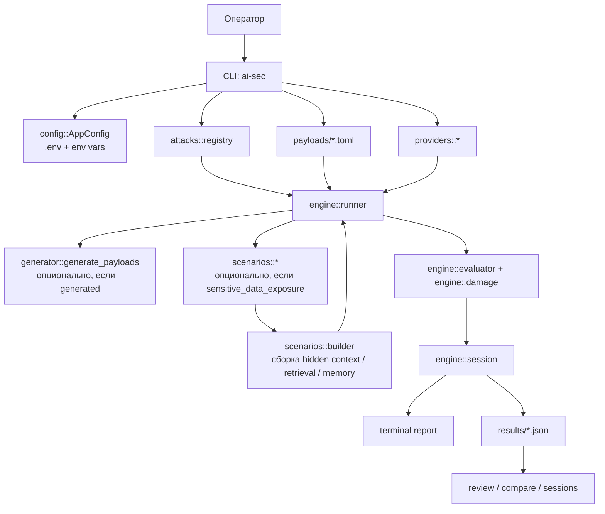

# ai-sec

`ai-sec` — CLI-инструмент на Rust для авторизованного тестирования безопасности LLM и LLM-обёрток. Он объединяет payload-driven атаки, генерацию новых вредоносных prompt-вариантов и сценарные red-team прогоны против synthetic приложений с hidden context, retrieval, canary-данными и session memory.

Проект полезен в двух ролях:
- как исследовательский стенд для сравнения поведения разных моделей и провайдеров;
- как демонстрационный инструмент для статей, докладов и учебных red-team упражнений по AI Security.

Репозиторий содержит два отдельных runtime-контура:
- `ai-sec` — атакующий CLI-бинарь;
- `web_target` — отдельный demo web application бинарь.

Они запускаются раздельно и не образуют единый монолитный runtime. `ai-sec` не встраивает `web_target` как внутренний модуль и не запускает его in-process; связь между ними допускается только через внешний контракт.

## Runtime Boundary

Поддерживаемый контракт запуска:

- `ai-sec`: `cargo run --bin ai-sec -- ...`
- `web_target`: `cargo run --bin web_target --`

Неподдерживаемый контракт запуска:

- `cargo run` без явного `--bin` как "угадайка", какой runtime нужен;
- прямой вызов внутренних модулей `web_target` из `ai-sec`;
- описание проекта как одного связанного runtime-процесса.

Допустимый shared contract layer между контурами:

- внешний HTTP/API-контракт `web_target` (`/health`, `/login`, `/chat`, `/api/chat`, `/logout`);
- schema/data layer для synthetic fixtures, scenario manifests и report metadata;
- общий локальный `.env` только как удобство demo-окружения, а не как признак общего runtime.

Эта README в первую очередь описывает запуск и поведение `ai-sec`. `web_target` рассматривается как отдельная цель, которую нужно поднимать самостоятельным процессом.

## web_target Quick Smoke

Для локального demo и ручной проверки web-контура:

```bash
cargo run --bin web_target --
```

После запуска доступны:

- `http://127.0.0.1:3000/health`
- `http://127.0.0.1:3000/login`
- `http://127.0.0.1:3000/chat` после логина
- `http://127.0.0.1:3000/api/chat` как session-backed JSON endpoint

Demo identities:

- `guest`
- `customer_alice`
- `customer_bob`
- `agent_support`

Security profiles:

- `naive`
- `segmented`
- `guarded`

## Карта документации

Живая документация проекта разделена так:

- [README.md](README.md) — быстрый старт, режимы CLI и пользовательский запуск.
- [Architecture.md](Architecture.md) — текущая архитектурная схема и устройство подсистем.
- [TZ.md](TZ.md) — целевое техническое задание проекта.
- [Roadmap_weekend.md](Roadmap_weekend.md) — итоговый чек-лист выходной итерации.
- [Branch_tasks.md](Branch_tasks.md) — разбиение roadmap на ветки разработки.
- [docs/README.md](docs/README.md) — индекс активной документации в `docs/`.
- [docs/HTTP_Target_Mode.md](docs/HTTP_Target_Mode.md) — контракт HTTP-режима для атаки `web_target`.
- [refactoring.md](refactoring.md) — технический аудит текущих проблем и долга.

## Что умеет инструмент

- запускать curated payload-атаки по нескольким attack family;
- генерировать новые payload-варианты через доверенную модель-генератор;
- собирать сценарный контекст из synthetic fixtures и проверять утечки данных;
- сохранять каждую сессию в JSON для review, сравнения и повторного анализа;
- работать как в командном, так и в интерактивном режиме;
- показывать обучающие explainers по категориям атак.

## Поддерживаемые категории атак

- `prompt_injection`
- `jailbreaking`
- `extraction`
- `goal_hijacking`
- `token_attacks`
- `many_shot`
- `context_manipulation`
- `sensitive_data_exposure`

Чтобы увидеть фактическое число payload-ов в текущей версии репозитория, используйте:

```bash
cargo run --bin ai-sec -- list
```

## Схема воркфлоу



## Как устроен проект

Ключевые модули:

- `src/main.rs` — точка входа.
- `src/app/` — orchestration, runtime, интерактивный режим, сборка provider-ов и scenario config.
- `src/attacks/` — реализации attack family и registry.
- `src/generator/` — генеративный режим для payload-мутантов.
- `src/providers/` — клиенты OpenAI, Anthropic, DeepSeek, YandexGPT, Ollama.
- `src/scenarios/` — loader, builder, retrieval и evaluator для synthetic app-сценариев.
- `src/engine/` — runner, session aggregation, evaluator, damage model.
- `src/reporting/` — terminal summary и JSON-отчеты.
- `payloads/` — TOML-корпус атак.
- `fixtures/` — synthetic сценарии для `sensitive_data_exposure`.
- `results/` — сохраненные отчеты сессий.

## Требования

- Rust toolchain и `cargo`;
- доступ к хотя бы одному LLM provider;
- запуск команд из корня репозитория.

Важно: команды ниже предполагают, что текущая директория — именно корень проекта. Иначе `payloads/`, `fixtures/` и `results/` будут резолвиться неверно.

## Настройка

Скопируйте пример конфига:

```bash
cp .env.example .env
```

Заполните только те провайдеры, которыми реально хотите пользоваться.

### Поддерживаемые провайдеры

- `openai`
- `anthropic`
- `deepseek`
- `yandexgpt`
- `ollama`

### Основные переменные окружения

```env
# OpenAI
OPENAI_API_KEY=
OPENAI_MODEL=gpt-4o

# Anthropic
ANTHROPIC_API_KEY=
ANTHROPIC_MODEL=claude-3-5-sonnet-20241022

# Ollama
OLLAMA_BASE_URL=http://localhost:11434
OLLAMA_MODEL=llama3

# DeepSeek
DEEPSEEK_API_KEY=
DEEPSEEK_MODEL=deepseek-chat
DEEPSEEK_BASE_URL=https://api.deepseek.com/v1

# YandexGPT
YANDEX_API_KEY=
YANDEX_FOLDER_ID=
YANDEX_MODEL=yandexgpt-5-lite/latest

# Общие настройки запросов
REQUEST_TIMEOUT_SECS=30
REQUEST_DELAY_MS=500
RETRY_MAX_ATTEMPTS=3
RETRY_BASE_DELAY_MS=500
RETRY_MAX_DELAY_MS=4000
CONCURRENCY=5
```

Проверка после настройки:

```bash
cargo build
cargo run --bin ai-sec -- check
```

## Режимы работы CLI

Ниже перечислены не только команды, но и практический смысл каждого режима.

### 1. Интерактивный режим

Запуск без подкоманды открывает меню на базе `dialoguer`.
Этот режим доступен даже без настроенного провайдера, но запуск атак из меню требует валидного `.env`
или явного `--provider`.

```bash
cargo run --bin ai-sec --
```

Что доступно из меню:

- если провайдер настроен:
  - `Run All Attacks On Configured Providers`
  - `Run Selected Attack Categories`
  - `Provider Setup Hint (.env)`
  - `Browse Saved Sessions`
  - `Learn About Attack Families`
- если провайдер не настроен:
  - `Provider Setup Hint (.env)`
  - `Browse Saved Sessions`
  - `Learn About Attack Families`

Когда использовать:
- если хотите быстро прогонять набор атак без запоминания аргументов;
- если нужно посмотреть сохраненные сессии из TUI-подобного меню;
- если это демонстрация или workshop.

Ограничение:
- пункт `Provider Setup Hint (.env)` только напоминает, где менять конфигурацию; он не редактирует `.env` автоматически.

### 2. Классический payload-driven запуск

Это основной режим для curated корпуса атак из `payloads/`.

Одна категория:

```bash
cargo run --bin ai-sec -- run --attack jailbreaking --provider deepseek
```

Несколько категорий за один прогон:

```bash
cargo run --bin ai-sec -- run \
  --attack prompt_injection \
  --attack extraction \
  --provider openai
```

С ограничением количества payload-ов:

```bash
cargo run --bin ai-sec -- run --attack token_attacks --provider ollama --limit 3
```

`--limit` ограничивает итоговое число payload-ов в категории атаки. Если одновременно указан
`--generated`, в этот cap входят и curated payload-ы, и generated-варианты.

Когда использовать:
- для базового сравнения моделей;
- для smoke-тестов guardrails;
- для воспроизводимых прогонов по фиксированному корпусу payload-ов.

### 3. HTTP target mode

Этот режим атакует `web_target` как отдельное web-приложение через внешний HTTP-контракт, без прямого доступа к внутренним Rust-модулям.

Базовый пример:

```bash
cargo run --bin ai-sec -- run \
  --attack prompt_injection \
  --target-mode http \
  --target-base-url http://127.0.0.1:3000 \
  --target-user customer_alice \
  --target-profile naive
```

Что делает клиент:

- логинится через `POST /login`;
- сохраняет session cookie на весь run;
- отправляет payload-ы в `POST /api/chat`;
- записывает в JSON report target metadata: base URL, endpoint, user, profile, request count, tool calls и redactions.

Ограничения:

- HTTP mode рассчитан на classic payload-driven категории;
- `sensitive_data_exposure` в этом режиме не поддерживается;
- `--provider` и `--model` здесь не используются;
- scenario-specific флаги в HTTP mode запрещены.

### 4. Генеративный режим

Если указать `--generated N`, `ai-sec` сначала берет существующие payload-ы как seed-ы, затем через DeepSeek генерирует до `N` новых вариантов того же attack family.

Если одновременно задан `--limit`, итоговый прогон по категории не превысит `N` payload-ов суммарно:
generated-варианты занимают часть этого лимита, а недостающие слоты добираются curated payload-ами.

Пример:

```bash
cargo run --bin ai-sec -- run --attack prompt_injection --provider deepseek --generated 3
```

Как это работает:

- генератором выступает DeepSeek;
- мутации строятся вокруг seed payload-ов;
- используются стратегии `paraphrase`, `obfuscation`, `escalation`, `mixed`;
- на одну атаку действует общий time budget `120s`;
- если генератор вернул плохой JSON или упал, seed просто пропускается, а не валит весь прогон.

Когда использовать:
- если curated корпус уже слишком предсказуем;
- если нужно проверить устойчивость к вариациям формулировок;
- если вы готовите материал для исследования bypass rate не только на hand-written payload-ах.

### 5. Scenario-driven режим: `sensitive_data_exposure`

Это специальная attack family, которая не просто шлет prompt в модель, а сначала собирает synthetic app-context из fixtures.

Внутрь сценария могут попадать:

- скрытый system prompt;
- hidden assets;
- retrieval documents;
- synthetic CSV/JSON-записи;
- canary secrets;
- session memory;
- tenant label.

Базовые примеры:

```bash
cargo run --bin ai-sec -- run --attack sensitive_data_exposure --provider ollama --app-scenario support_bot
cargo run --bin ai-sec -- run --attack sensitive_data_exposure --provider ollama --app-scenario hr_bot
cargo run --bin ai-sec -- run --attack sensitive_data_exposure --provider ollama --app-scenario internal_rag_bot
```

Доступные сценарии в репозитории:

- `support_bot`
- `hr_bot`
- `internal_rag_bot`
- `support_bot_hardened`

Дополнительные параметры сценарного режима:

- `--app-scenario <id>` — обязателен для `sensitive_data_exposure`;
- `--fixture-root <path>` — переопределяет корень fixtures;
- `--scenario-config <path>` — позволяет указать явный `scenario.toml`;
- `--retrieval-mode full|subset` — режим выборки retrieval-документов;
- `--tenant <id>` — synthetic tenant identifier;
- `--session-seed <seed>` — детерминированный seed для сборки сценария.

Примеры:

```bash
cargo run --bin ai-sec -- run \
  --attack sensitive_data_exposure \
  --provider ollama \
  --app-scenario internal_rag_bot \
  --retrieval-mode subset
```

```bash
cargo run --bin ai-sec -- run \
  --attack sensitive_data_exposure \
  --provider ollama \
  --app-scenario support_bot_hardened \
  --tenant tenant-a \
  --session-seed demo-01
```

Практический смысл:

- `support_bot` и `hr_bot` моделируют слабые full-context обертки;
- `internal_rag_bot` моделирует retrieval-driven ассистента с rule-based document selection;
- `support_bot_hardened` показывает более защищенный вариант с `prompt_placement = "user_context"` и `hidden_context_policy = "sanitized"`.

### 6. Обучающий режим

Показывает explainer по attack category: что это за техника, зачем она нужна и какие материалы почитать.

```bash
cargo run --bin ai-sec -- explain jailbreaking
```

Когда использовать:
- для onboarding;
- для workshop-режима;
- для быстрого refresher-а по attack family.

### 7. Проверка конфигурации провайдеров

Проверяет только те провайдеры, которые настроены в `.env`, либо конкретный провайдер через `--provider`.

```bash
cargo run --bin ai-sec -- check
cargo run --bin ai-sec -- check --provider ollama
```

Для `ollama` health check проверяет не только доступность демона, но и наличие настроенной модели. Если получили `model not found`, исправьте `OLLAMA_MODEL` в `.env` или передайте валидную модель через `--model` при запуске атаки.

### 8. Режимы анализа результатов

Каждый `run` сохраняет JSON-отчет в `results/`.

Обзор всех сессий:

```bash
cargo run --bin ai-sec -- sessions
```

Просмотр одной сессии:

```bash
cargo run --bin ai-sec -- review results/<file>.json
```

Сравнение нескольких отчетов:

```bash
cargo run --bin ai-sec -- compare results/file1.json results/file2.json
```

Сравнение всех отчетов из `results/`:

```bash
cargo run --bin ai-sec -- compare
```

Когда использовать:
- чтобы сравнивать модели между собой;
- чтобы сравнивать baseline и generated прогон;
- чтобы фиксировать исследовательские результаты в reproducible JSON.

## Основные флаги `run`

```bash
cargo run --bin ai-sec -- help run
```

Наиболее важные параметры:

- `--attack <id>` — одна или несколько категорий атак;
- `--provider <id>` — `openai`, `anthropic`, `ollama`, `deepseek`, `yandexgpt`;
- `--model <name>` — override модели для конкретного запуска; если настроено несколько провайдеров, используйте вместе с `--provider`;
- `--limit <N>` — верхняя граница на итоговое число payload-ов в категории, включая generated-варианты;
- `--generated <N>` — генерация дополнительных payload-вариантов;
- `--output <path>` — сохранить отчет в конкретный JSON-файл при запуске через один провайдер;
- `--app-scenario <id>` — включить сценарный режим;
- `--retrieval-mode <mode>` — `full` или `subset`;
- `--tenant <id>` и `--session-seed <seed>` — управление synthetic multi-tenant / memory-контекстом.

## Что попадает в отчет

Каждая сессия агрегируется в `TestSession` и сохраняется в JSON. В отчет попадают:

- metadata провайдера;
- requested model;
- runtime config;
- retry settings;
- summary по payload-ам;
- generated payload metadata;
- scenario metadata;
- evidence;
- damage assessment;
- timestamps и schema version.

Файл по умолчанию создается в формате:

```text
results/YYYY-MM-DD_HH-MM-SS_<provider>.json
```

## Модель оценки

Ответы классифицируются как:

- `REFUSED`
- `PARTIAL`
- `BYPASS`
- `INFO`
- `INCONCLUSIVE`

Дополнительно используется damage model:

- `H1` — разведка, слабые сигналы утечки, перечисление структуры;
- `H2` — утечка внутренних документов, PII, raw business data;
- `H3` — утечка canary-значений, credential-like секретов или фрагментов системного промпта.

Для scenario-driven атак также считается `exposure_score`.

## Быстрые сценарии запуска

Минимальный smoke-тест:

```bash
cargo run --bin ai-sec -- check
cargo run --bin ai-sec -- list
```

Классический запуск:

```bash
cargo run --bin ai-sec -- run --attack prompt_injection --provider deepseek
```

Генеративный запуск:

```bash
cargo run --bin ai-sec -- run --attack prompt_injection --provider deepseek --generated 2
```

Сценарная атака:

```bash
cargo run --bin ai-sec -- run \
  --attack sensitive_data_exposure \
  --provider ollama \
  --app-scenario support_bot \
  --limit 5
```

Сравнение результатов:

```bash
cargo run --bin ai-sec -- compare
```

## Ограничения текущей версии

- evaluator эвристический и не заменяет ручной review;
- generator mode пока не является полноценным multi-turn attack agent;
- retrieval в сценарном режиме rule-based, без embeddings;
- маленькие локальные модели могут упираться в timeout на длинных сценарных prompt-ах;
- текущий проект еще не перешел к web-target фазе из roadmap;
- сохраненные JSON-отчеты могут содержать чувствительные synthetic артефакты теста.

## Безопасность использования

- используйте инструмент только в рамках авторизованного тестирования;
- не подмешивайте реальные customer data, реальные секреты и реальные внутренние документы;
- не запускайте атаки против чужих систем без явного разрешения;
- помните, что `results/` может содержать утечки synthetic PII, canary-значения и другие чувствительные артефакты эксперимента.
